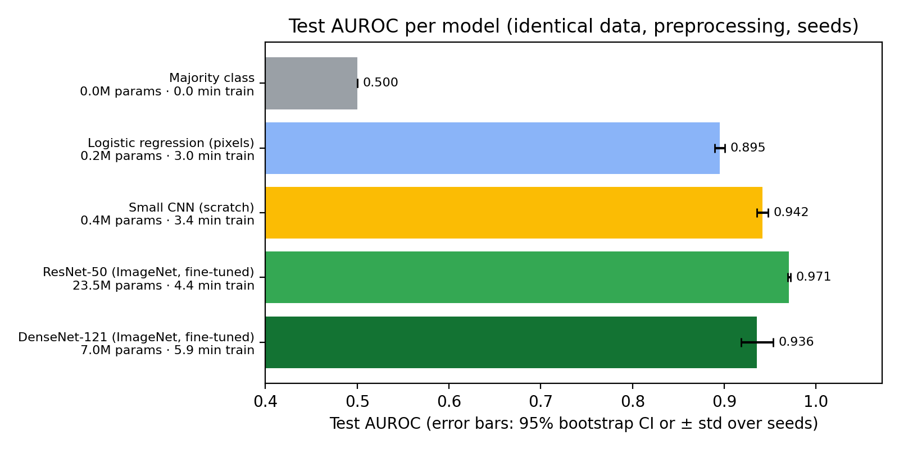
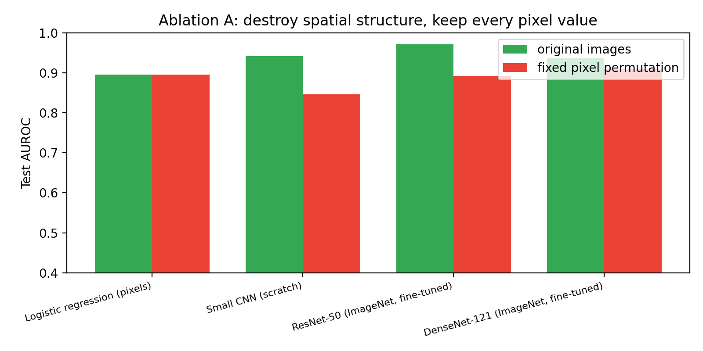
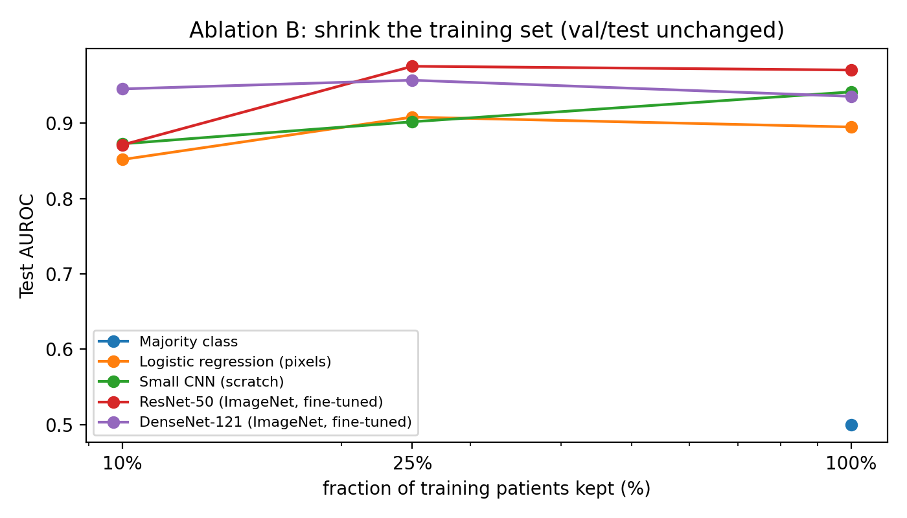

# Results summary

## Main comparison (test split)

| Rank | Model | AUROC | AUROC 95% CI (seed 1) | Accuracy | Balanced acc. | Macro-F1 | Recall (pneu.) | Specificity | Params (M) | Ckpt (MB) | Train time (min) | Infer (ms/img) | Seeds |
|---|---|---|---|---|---|---|---|---|---|---|---|---|---|
| 1 | ResNet-50 (ImageNet, fine-tuned) | 0.9706 ± 0.0015 | [0.956, 0.984] | 0.8625 ± 0.0343 | 0.8169 | 0.8374 ± 0.0455 | 0.9974 | 0.6364 | 23.51 | 94.3 | 4.4 | 1.86 | 2 |
| 2 | Small CNN (scratch) | 0.9416 ± 0.0060 | [0.924, 0.963] | 0.8261 ± 0.0034 | 0.7686 | 0.7885 ± 0.0044 | 0.9961 | 0.5411 | 0.39 | 1.6 | 3.4 | 1.50 | 2 |
| 3 | DenseNet-121 (ImageNet, fine-tuned) | 0.9357 ± 0.0174 | [0.893, 0.948] | 0.8220 ± 0.0275 | 0.7623 | 0.7812 ± 0.0405 | 0.9987 | 0.5260 | 6.96 | 28.4 | 5.9 | 2.34 | 2 |
| 4 | Logistic regression (pixels) | 0.8950 ± 0.0056 | [0.872, 0.922] | 0.7743 ± 0.0423 | 0.7042 | 0.7135 ± 0.0659 | 0.9819 | 0.4264 | 0.15 | 0.6 | 3.0 | 1.32 | 2 |
| 5 | Majority class | 0.5000 ± 0.0000 | [0.500, 0.500] | 0.6262 ± 0.0000 | 0.5000 | 0.3851 ± 0.0000 | 1.0000 | 0.0000 | 0.00 | 0.0 | 0.0 | 1.23 | 2 |

## Ablation A - fixed pixel permutation

Prediction: the linear model is unaffected (permutation-invariant); models that won by exploiting local spatial texture lose their advantage and the ranking changes.

| Model | auroc_normal | auroc_permuted | delta | rank_normal | rank_permuted | acc_normal | acc_permuted |
|---|---|---|---|---|---|---|---|
| Logistic regression (pixels) | 0.8950 | 0.8949 | -0.0001 | 4 | 2 | 0.7743 | 0.7727 |
| Small CNN (scratch) | 0.9416 | 0.8463 | -0.0952 | 2 | 4 | 0.8261 | 0.7605 |
| ResNet-50 (ImageNet, fine-tuned) | 0.9706 | 0.8926 | -0.0780 | 1 | 3 | 0.8625 | 0.7743 |
| DenseNet-121 (ImageNet, fine-tuned) | 0.9357 | 0.9088 | -0.0269 | 3 | 1 | 0.8220 | 0.7605 |

## Ablation B - training-set size

Training images per fraction: {'10% train': 445, '25% train': 1108, '100% train': 4424}. Prediction: the gap between ImageNet-pretrained models and models learned from scratch widens as data shrinks.

| model | 10% train | 25% train | 100% train | 10% train rank | 25% train rank | 100% train rank |
|---|---|---|---|---|---|---|
| Majority class |  |  | 0.5000 |  |  | 5 |
| Logistic regression (pixels) | 0.8518 | 0.9081 | 0.8950 | 4 | 3 | 4 |
| Small CNN (scratch) | 0.8727 | 0.9019 | 0.9416 | 2 | 4 | 2 |
| ResNet-50 (ImageNet, fine-tuned) | 0.8712 | 0.9756 | 0.9706 | 3 | 1 | 1 |
| DenseNet-121 (ImageNet, fine-tuned) | 0.9455 | 0.9571 | 0.9357 | 1 | 2 | 3 |

## Extra check - removing the aspect-ratio (padding) cue

Same split, same seeds, images squashed to a square instead of padded, so the original aspect ratio is no longer visible. Tests whether the false positives on test NORMAL images come from the geometry shortcut found in the audit.

| Model | auroc_pad | auroc_stretch | spec_pad | spec_stretch | bal_acc_pad | bal_acc_stretch |
|---|---|---|---|---|---|---|
| Majority class | 0.5000 | 0.5000 | 0.0000 | 0.0000 | 0.5000 | 0.5000 |
| Logistic regression (pixels) | 0.8950 | 0.9119 | 0.4264 | 0.5974 | 0.7042 | 0.7780 |
| Small CNN (scratch) | 0.9416 | 0.9471 | 0.5411 | 0.7403 | 0.7686 | 0.8624 |
| ResNet-50 (ImageNet, fine-tuned) | 0.9706 | 0.9896 | 0.6364 | 0.8095 | 0.8169 | 0.9035 |
| DenseNet-121 (ImageNet, fine-tuned) | 0.9357 | 0.9836 | 0.5260 | 0.7273 | 0.7623 | 0.8611 |

## Correct-classification rate by image subtype (test split)

Pneumonia is one label covering bacterial and viral cases; viral pneumonia is typically more diffuse and harder to see.

| model | bacteria (n=240) | normal (n=231) | virus (n=147) |
|---|---|---|---|
| Majority class | 1.0000 | 0.0000 | 1.0000 |
| Logistic regression (pixels) | 0.9903 | 0.4834 | 0.9478 |
| Small CNN (scratch) | 0.9889 | 0.6075 | 0.9977 |
| ResNet-50 (ImageNet, fine-tuned) | 0.9958 | 0.6941 | 1.0000 |
| DenseNet-121 (ImageNet, fine-tuned) | 0.9972 | 0.5931 | 0.9977 |

# Data audit

Prepared 2026-09-25T15:02:17+00:00 from `/content/repo/data/raw` (strategy: `original_test`).

## Size

- Files found: **11712** ({'PNEUMONIA': 8546, 'NORMAL': 3166})
- Original folders x class: {'NORMAL': {'test': 468, 'train': 2682, 'val': 16}, 'PNEUMONIA': {'test': 780, 'train': 7750, 'val': 16}}
- Corrupt: 0; exact-duplicate redundant files: 94
- Patients (grouping keys): 3288 ({'NORMAL': 1443, 'PNEUMONIA': 1845}); 1155 have >1 image (max 30)
- Resolution: width {'min': 384, 'median': 1281, 'max': 2916}, height {'min': 127, 'median': 888, 'max': 2713}, aspect {'min': 0.835, 'median': 1.416, 'max': 3.379}, 4803 distinct sizes; modes {'L': 11146, 'RGB': 566}
- Features: model input 224x224x3 = 150528 values (grayscale replicated to 3 channels); median raw image ~1,137,528 pixels

## Final splits (patient-grouped, seed-fixed)

- {'NORMAL': {'test': 231, 'train': 1145, 'val': 203}, 'PNEUMONIA': {'test': 387, 'train': 3279, 'val': 579}}
- Subtypes: {'bacteria': {'test': 240, 'train': 2145, 'val': 375}, 'normal': {'test': 231, 'train': 1145, 'val': 203}, 'unknown': {'test': 0, 'train': 0, 'val': 1}, 'virus': {'test': 147, 'train': 1134, 'val': 203}}
- Leakage checks after split: {'patient_keys_shared_train_val': 0, 'patient_keys_shared_train_test': 0, 'near_dup_pairs_train_test': 0, 'near_dup_pairs_train_val': 0}

## Problems found

1. 566 files are stored as 3-channel RGB although X-rays are grayscale; all images were converted to single-channel.
2. Image resolution is not standardised: 4803 distinct sizes, width 384-2916 px, aspect ratio 0.835-3.379. We pad to square before resizing so anatomy is not stretched.
3. 5794 files are byte-identical copies of a file with the same name (archive packaging, e.g. a nested folder); one copy is kept.
4. 94 byte-identical duplicate images stored under different names, in 30 groups (0 groups span two original splits, 0 carry conflicting labels). One copy is kept; conflicting-label groups are dropped entirely.
5. 1155 patients contribute more than one image (3691 images, up to 30 per patient). Splitting by image instead of by patient puts the same child on both sides of a split (leakage).
6. Class imbalance: 72.9% of images are PNEUMONIA. Accuracy alone is misleading; a majority-class predictor already scores that number.
7. Class prior shifts between the original train (74.2% pneumonia) and test (62.6% pneumonia) folders: the test folder is a separate collection, not an i.i.d. sample of the training distribution.
8. The dataset ships a validation folder of only 16 images - useless for model selection. We merge it into the training pool and carve a patient-grouped validation set of our own.
9. Simulated naive by-image random split (15% val): 479 of 781 validation images (61.3%) would share a patient with the training set. Our split assigns whole patients.
10. Acquisition geometry leaks the label: image height alone separates the classes with AUROC 0.916 on train / 0.921 on test (median W x H, aspect: NORMAL (1636, 1318, 1.222), PNEUMONIA (1168, 784, 1.484) in train). Resizing removes absolute size; with pad-to-square the aspect ratio survives as padding (AUROC 0.865 train / 0.703 test), a shortcut that transfers poorly to the test folder.

## Near-duplicate calibration

Nearest-neighbour pHash distance percentiles: {'p1': 50, 'p5': 56, 'p10': 60, 'p25': 66, 'p50': 72, 'p75': 78, 'p90': 84} (threshold 10 bits of 256).
